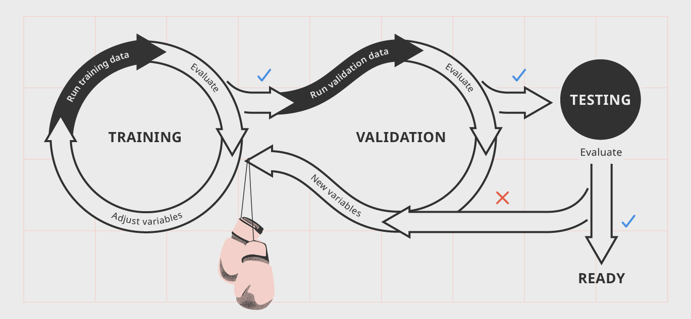

# """"""""""""""""""""""""" RAMHI Fatima Ezzahra """"""""""""""""""""""""""#

# ========================== Rapport===========================#

# Classification des documents du procès des groupes américains du tabac

# ============================================================#

## But du Projet: 

Le but de ce travail est d'analyser et de classifier un échantillon de données , qui sont des document colléctés et numérisé, et qui peuvent être désignés comme preuve de l'existance d'un lien entre la consommation du Tabac et des maladies graves.

## L'ensemble de données  

Les données qu'on a à notre possession ont été classés dans des répertoires correspondants aux classes de documents:
 
 
Chaque classe contient plusieurs documents .
Voici Quelque extraits :
* **Classe** : Advertissement :
* **Classe** : Email :

### Distribution des données: 

Celon le graphe ci dessous, on remarque des classes dominantes par rapport aux autres, comme les classes Email, Letter, Memo.

### Pré traitement des données:  

Cette étape pourrait être primordiale , car c'est une approche qui  consiste à supposer que la plus petite unité d'information dans un texte est le mot . Nous allons donc représenter nos textes sous forme de séquences de mots.

Pour cela, on va proceder comme suit:
        * Supprimer les tags html(s'ils existents)
        * Remplacer les ponctuations par des espaces
        * Remplacer les lettres majuscule en minuscule . 

**Exemple :** 

**Avant les pré traitement **
**Après les pré traitement **

### Séparation des données : 

En géneral on a besoin de 2 sets de données ( Training , Testing) 
*   **Training set** :ou le jeu de données d'apprentissage , est le jeu de données initial utilisé pour former un algorithme afin de comprendre comment appliquer des technologies telles que les réseaux de neurones, pour apprendre et produire des résultats complexes. Il inclut les données d'entrée et la sortie attendue correspondante. Le but du jeu de données d'apprentissage est de fournir à votre algorithme des données de «vérité sur le terrain».
*  **Testing set** : ou le jeu de données de test, cependant, est utilisé pour évaluer le degré de l'apprentissage de votre algorithme . Vous ne pouvez pas simplement réutiliser le jeu de données d'apprentissage lors de la phase de test car l'algorithme "connaît" déjà la sortie attendue, ce qui va à l'encontre de l'objectif de test de l'algorithme.
 
On peut ajouter un 3ème set qui est le jeu de donnée de validation ,qui seert en géneral à fournir une évaluation non biaisée d'un ajustement de modèle sur l'ensemble de données d'apprentissage tout en ajustant les hyperparamètres du modèle (par exemple, le nombre d'unités cachées dans un réseau de neurones ). Les jeux de données de validation peuvent être utilisés pour la régularisation en arrêtant tôt: arrêtez la formation lorsque le nombre d'erreurs sur le jeu de données de validation augmente, car il s'agit d'un signe de surajustement pour le jeu de données de formation

## Partie Classification : 

j'ai utilisé trois classifieurs :
1. Classifieur Bayesien Naif .
2. Reseau de neurones Convolutionnel .
3. Reseau de neuronnes Multi couches.

L'objectif est de preserver le clssifieur avec le plus grand score , pour cela je vais utiliser 3 metriques d'evaluation (Precision, Recall ,F1 score):
    
    

Ainsi je vais utiliser les matrices de confusion pour chaque classifieur , qui est , dans la terminologie de l'apprentissage supervisé, un outil servant à mesurer la qualité d'un système de classification

 Dans python , sklearn.metrics propose 2 librairies:classification_report,confusion_matrix.
    

###  1.Classifier Bayésien Naif 

** Vectorisation **:Pour appliquer des algorithmes d'apprentissage automatique au texte, les documents doivent être transformés en vecteurs.

J'ai utilisé ce classifieur pour 3 representations differents:
* Bag of Word
* Word Level TF-IDF
* N-gram Level TF-IDF

**Representation Bag of Word **:
 Le moyen le plus simple et le plus classique de transformer un document en vecteur est l’encodage en sac de mots.
 1. Définir l'ensemble de tous les mots possibles pouvant figurer dans un document; notez sa taille par max_features.
 2. Pour chaque document, encodez-le avec un vecteur de taille max_features, avec la valeur de la ième composante du vecteur égale au nombre de fois où le ième mot apparaît dans le document.

    

** Word level TF-IDF **:
    MAtrice representant les scores tf-idf de chaque terme dans les differents documents.

**N-gram Level TF-IDF **:N-grams est la combinaison de N termes . Et cette MAtrice represente les scores tf-idf de N_grams

On remarque que les resultats du classifieur bayésien avec une representation (N_gram Level TF_IDF) donne de mailleur resultats que les autres representation 

###  2.Reseau de Neurone Convolutionnel 

En general les reseaux de neurones Convolutionnel servent à capturer des informations hiérarchiques ,
L’essentiel d’un CNN est de regarder une région de l’entrée à la fois, de l’affecter à une sortie et de répéter ce processus pour chaque région de l’entrée.
En plaçant une série de convolutions l’une après l’autre, nous faisons apprendre notre réseau de manière hiérarchique: chaque couche suivante est une convolution des valeurs de la couche précédente.

Dans cette partie j'ai utilisé un model simple , avec géneralement une couche CNN, une couche maxPlooling

Le pooling sert à  :
* Réduire la dimension de chaque feature map 
* Prendre l’information la plus importante.

Et si on choisit le Max Pooling:
 * Prend le maximum d’un voisinage.

Le ** DropOut **: est une technique ne regularisation , qui prend d’eune manière aléatoire quelque neurones qui va les ignorer pendant l’entrainement.au fur et a mesure qu'un réseau de neurones apprend, les poids de neurones s'installent dans leur contexte au sein du réseau.

**Resultat:**

###  3.Reseau de neuronnes Multi Couches (Multi Layer Perceptron) 

**Multi Layer Perceptron**  (MLP) ,est une classe de réseaux neuronaux artificiels à anticipation. Un MLP se compose d'au moins trois couches de nœuds: une couche d'entrée, une couche cachée et une couche de sortie. À l'exception des nœuds d'entrée, chaque nœud est un neurone utilisant une fonction d'activation non linéaire. MLP utilise une technique d'apprentissage supervisée appelée rétropropagation pour la formation. Ses multiples couches et son activation non linéaire distinguent MLP d'un perceptron linéaire. Il peut distinguer des données qui ne sont pas séparables linéairement.

